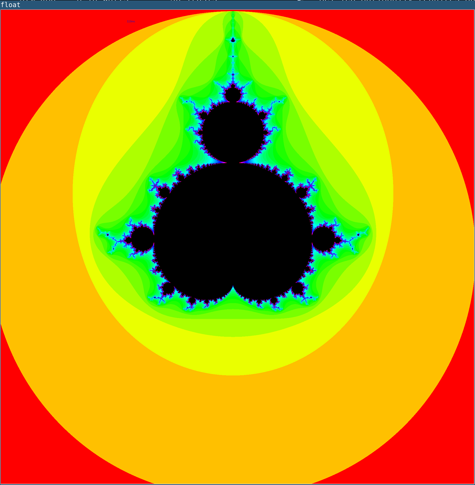
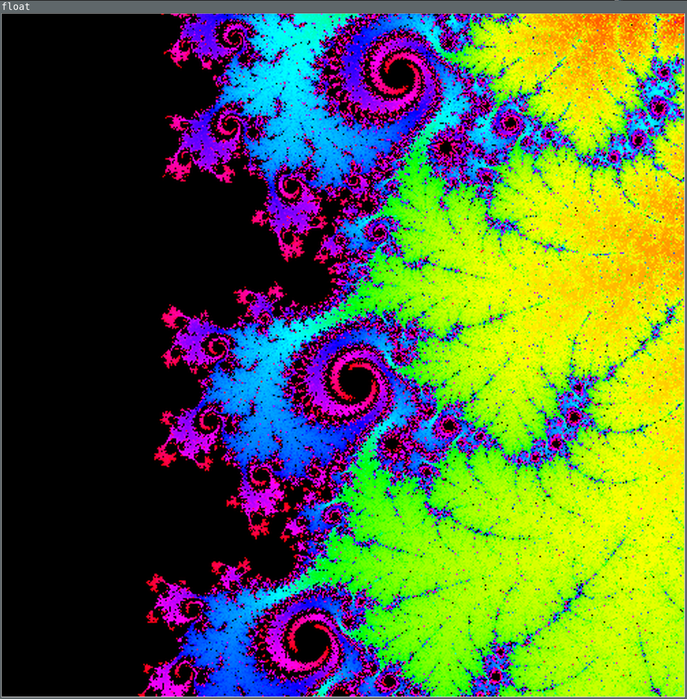
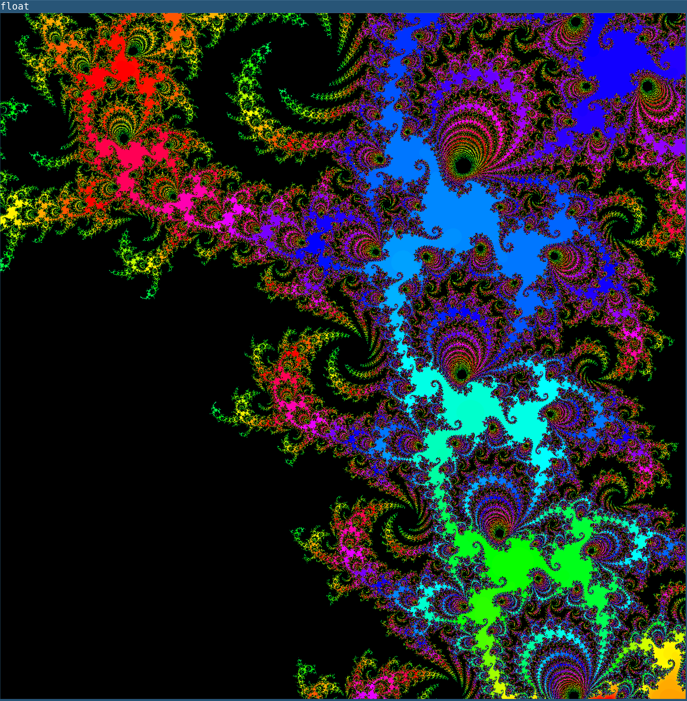

# Mandelbrot Set Renderer

## Background
This is a Python program I wrote a while ago to render the Mandelbrot set.  I started it in early 2017 and have improved it quite a bit since then, rewriting the code multiple times to make it a bit better.\
The main feature of this is that it uses OpenCL to compute the pixel values, meaning that it is able to run on the GPU.  This brings a huge speedup over the CPU, and also meant that I was able to learn how OpenCL works.

## Usage
The current version of the program requires a working installation of OpenCL, `pyopencl` and OpenCV's Python 3 bindings.  To run the program, run `python mandelbrot.py` and then use the keyboard to control the view.\
Keybindings:\
 - `w a s d` to move the view up, left, down, and right respectively
 - Up/Down arrows to increase/decrease the number of iterations
 - `f` to switch between 32 bit and 64 bit arithmetic
 - Page Up/Page Down to zoom in/out

## Screenshots

